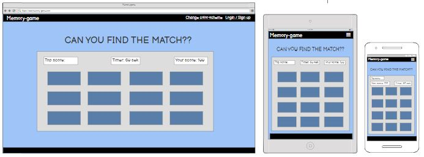
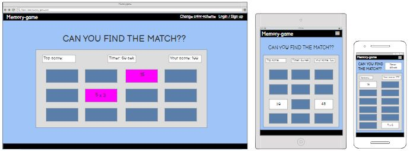
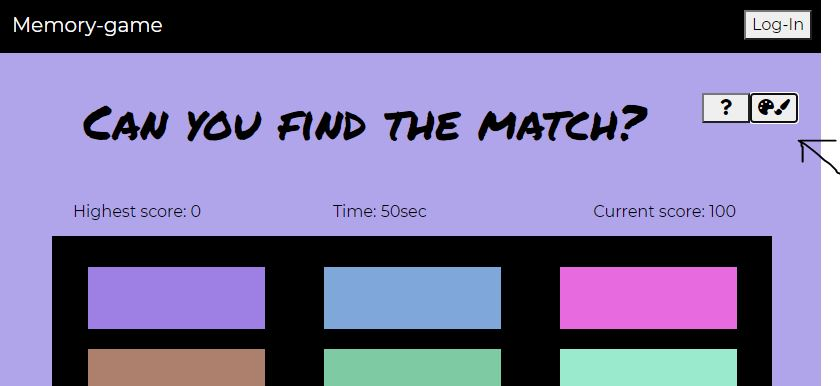

# MEMORY-GAME
## Match six equations with their answers, in under 1 minute

The idea is to randomly assign pairs of random equations and their respective answers to the "game-cards", let the 

Click here to view the website

## User Experience (UX)

### User stories:

### First time visitor goals
.....

### Returning visitor goals
.....

### Frequent user goals
Log in to keep track of past scores, and chosen color-scheme.

.....

### Site owner goals
That people enjoy playing, and 
.........

## Design

### Colour scheme:
....

### Typography:
....

### Imagery:

Currently there are no images added to the game, only colours.

## Wireframes

## Features

- ### Random colours
Press the painters-button to add new colours randomly to all the "game-cards" and to the background-color of the website. Keep clicking, until you find a combination you like! :)

- Feature 2 included
- Feature 3 included

#### Future features:

- Option to play as guest, or to log in with user, to keep track of scores, see other users best scores, and keep chosen colour-schemes.
- A timer that counts down as you solve the tasks, and when the counter reaches 0, its game over.
- A beeper that makes a noise every second for the last 10 seconds of each game (with option to turn sound off).
- Happy-sound when a good match is made.
- Possibility to choose between several different game-question-types. Different math-questions matching questions with correct answer (either addition, subtraction, miltiplication or divison), mathing chemical formulas with correct name, matching two parts of a famous quote, and much more.

## Issues overcome

### Instructions for playing
Instructions for playing the game have been added as a modal, overlaying the whole page. This option has been chosen, in order to be able to explain the game, without having a lot of tekst on the page. The modal is triggered by clicking the question-mark-button on the top right.

### Media-query
Added a media-query to to scale main headline (h1) well beth for smaller and larger devicer. 

### Several right answers
What if two equations on the board have same answer? The check-answer must do the calculation, and not just look for pairs, otherwise a right answer may be rejected because it is not the right pair.

## Technology used
### Programming languages:
- html
- css
- Bootstrap
- jQuery

### Frameworks, libraries and programs:
- Bootstrap
- Google Fonts
- Font-awsome

## Testing

### Validation:
#### HTML validation
Html-content checked with https://validator.w3.org/nu/#textarea

#### CSS validation
CSS tested with W3C CSS Validator Service. 
After having corrected a few small errors, everything is as it should be.

JS validation

### Testing for user stories in UX-section:

### Further testing:
#### Test on different screen sizes:
Expected: X when Y
Testing: do Y
Result: The site did not respond due to ..."A" or: the site acted as expected and did X
Fix: Did Z to the code because of problem..."A"

#### Test on different browsers:
Expected: X when Y
Testing: do Y
Result: The site did not respond due to ..."A" or: the site acted as expected and did X
Fix: Did Z to the code because of problem..."A"

 

## Fixed bugs:
### Problems with alignment in game-area:
There was a problem with the horisontal alignment of the game-cards in the game-area, they were not in center.

I added classes container-fluid to full-page-divs, and container to game-area-div, and took away margins. This made the alignment somewhat better on large viewports, and much better on mobile and medium devices, but still not centered.

I fixed the horizontal alignment-issue on larger screens by using bootstrap-rows and columns on my game-card-divs, but though this layout worked fine on larger screens, it was still not good on smaller screens. 

Therefore I decided to start in the other direction, and make 3 columns in smaller devices, and add the fourth column in on medium and larger devices, using “d-none”-class on the ones that should not be seen in small devices. This works fine on mobile, but not perfect yet on larger screens (the last column is smaller).

The issue was finally solved with class="col-3 col-lg-2” for the three first boxes in each row, and class="d-none d-lg-block” for the fourth box.

### Bug 2

## Unfixed bugs:
### Website height
The website is supposed to be the height of the viewport, with no need for scrolling, but I have difficulty managing that while keeping nav and footer fixed at top and bottom. As it is there is a little scroll available, but it is not necessary to scroll the page to see it all, so it does not seem to hinder the game.

### The game itself is not set up yet, only planned
It will take a bit of research to figure out how to randomly assign pairs of random equations and their respective answers to the "game-cards", 

## Deployment
This project was developed using Visual Studio Code, committed to git and pushed to GitHub using git-extensions in Visual Studio Code.

### Steps to deploy this page to GitHub Pages from GitHub repository:
1. Log into GitHub.
2. Find the project "" from the list of repositories and open it.
3. Go to the “Settings”-option.
4. Scroll down to the section called “Pages” in the menu on the left side, and click it to open the Github-pages page.
5. Under "Source", select the correct branch (in this case, “main”), and click on the Save-button.

6. The page will refresh, and the message on top says:
“Your site is ready to be published at: https://gurimarie....love-maths/.”
Use this link to access the deployed website.

### Forking the GitHub repository:

### Making a local clone:
1. Follow this link (MUST BE LINKED UP!) to the projects Github repository.
2. Under the repository name, click the green "Code"-button, and choose "https" and click on the "Download Zip"-option.
3. When the zip is downloaded, open the folder, and move the unzipped folder to where you wish to store it on your computer.
4. Open your Visual Studio Code (or other programming-software), click File, Open Folder, and choose the unzipped folder you just downloaded from where you saved it to.
 

## Credits

### Code:
- Random-color-function from AndreFelipeCL, found at "https://stackoverflow.com/questions/20553036/random-color-in-jquery"
- README-structure heavily insipred by https://github.com/PaulFrankling/discover-north-yorks.
- Code Institute courses for everything

### Content:

### Media used:

### Acknowledgements:

